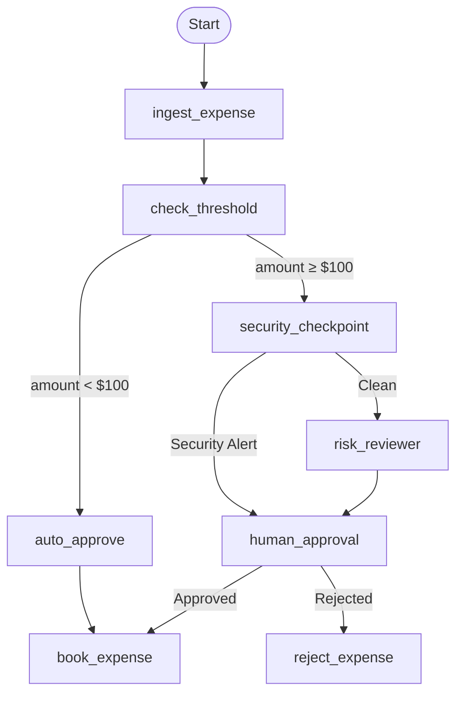

# 💳 Ambient Expense Agent

> An AI-powered corporate expense approval system built with **Google Agent Development Kit (ADK) 2.0** using the **Graph Workflow API**. The agent automatically validates, categorizes, reviews, and approves employee expense reports while integrating AI-assisted decision making with deterministic workflow execution and human-in-the-loop approvals.


---

# 📖 Overview

Corporate expense approvals often require balancing automation, policy compliance, and security. Traditional rule-based systems become difficult to maintain as business policies evolve.

Ambient Expense Agent demonstrates how **Google ADK 2.0 Graph Workflows** can orchestrate AI-assisted business processes while maintaining deterministic execution and enterprise-grade approval controls.

The workflow automatically approves low-risk expenses while routing higher-value submissions through security validation, AI-assisted risk review, and human approval before final booking.

---

# ✨ Features

- 🤖 AI-assisted expense validation
- 💰 Automatic approval for low-value expenses
- 🔒 Security checkpoint before manual review
- 👤 Human-in-the-loop approval workflow
- 📄 Receipt & expense verification
- ⚡ Google ADK 2.0 Graph Workflow implementation
- 📊 Built-in evaluation support
- 📈 Cloud Trace & observability ready
- ☁ Deployable to Google Agent Runtime

---

# 🏗 Graph Workflow Architecture



---

# 🔄 Workflow

### 1️⃣ Ingest Expense

Receives an employee expense report and performs initial validation.

---

### 2️⃣ Threshold Check

Determines whether the submitted amount exceeds the automatic approval threshold.

- **Less than $100**
  - Automatically approved.

- **Greater than or equal to $100**
  - Sent for additional validation.

---

### 3️⃣ Security Checkpoint

Performs security and policy validation before AI review.

Possible outcomes:

- Clean
- Security Alert

---

### 4️⃣ Risk Reviewer

Uses AI reasoning to analyze higher-value expenses.

Evaluates:

- Spending patterns
- Policy compliance
- Potential anomalies
- Business justification

---

### 5️⃣ Human Approval

High-risk or security-sensitive expenses require manual approval.

Decision:

- ✅ Approved
- ❌ Rejected

---

### 6️⃣ Final Processing

Approved expenses:

```
Book Expense
```

Rejected expenses:

```
Reject Expense
```

---

# 🛠 Technology Stack

| Category | Technology |
|-----------|------------|
| Language | Python 3.11+ |
| Framework | Google ADK 2.0 |
| Workflow | Graph Workflow API |
| Runtime | Google Agents CLI |
| Package Manager | uv |
| Deployment | Google Agent Runtime |
| Infrastructure | Terraform |
| Testing | Pytest |
| Observability | Cloud Trace |

---

# 📂 Project Structure

```
ambient-expense-agent/

├── artifacts/
│
├── deployment/
│   └── terraform/
│
├── expense_agent/
│   ├── app/
│   ├── graph/
│   ├── tools/
│   └── prompts/
│
├── tests/
│
├── README.md
├── GEMINI.md
├── pyproject.toml
├── uv.lock
└── Makefile
```

---

# 🚀 Getting Started

## Prerequisites

- Python 3.11+
- uv
- Google Agents CLI
- Google ADK 2.0
- Google AI Studio API Key

---

## Clone Repository

```bash
git clone https://github.com/<YOUR_USERNAME>/ambient-expense-agent.git

cd ambient-expense-agent
```

---

## Install Dependencies

```bash
uv sync

agents-cli install
```

---

## Configure Environment

Create a `.env` file in the project root.

```env
GEMINI_API_KEY=YOUR_API_KEY
```

Alternatively, authenticate using Google Cloud.

```bash
gcloud auth application-default login
```

---

## Launch Development Playground

```bash
agents-cli playground
```

---

# 🧪 Running Tests

```bash
uv run pytest
```

---

# 📊 Evaluate the Agent

Run automated evaluation suites.

```bash
agents-cli eval
```

This generates:

- Quality metrics
- Agent traces
- Evaluation reports
- Model performance insights

---

# 🚀 Deployment

Configure Google Cloud.

```bash
gcloud config set project YOUR_PROJECT_ID
```

Deploy:

```bash
agents-cli deploy
```

---

# 📈 Observability

The project exports telemetry to Google Cloud services.

Supported integrations:

- Cloud Trace
- Cloud Logging
- BigQuery

This enables production monitoring and debugging.

---

# 🔒 Security

The workflow incorporates multiple security mechanisms.

- Security checkpoint node
- Human approval for high-risk requests
- Policy validation
- AI-assisted risk analysis
- Prompt injection protection
- Safe workflow execution

---

# 📚 Learning Objectives

This project demonstrates:

- Google ADK 2.0
- Graph Workflow API
- Function Nodes
- Conditional Edges
- Human-in-the-loop workflows
- AI-assisted enterprise automation
- Agent deployment
- Agent evaluation
- Cloud-native observability

---

# 🗺 Roadmap

Future improvements:

- [ ] OCR receipt extraction
- [ ] Fraud detection model
- [ ] Slack approval integration
- [ ] Email notifications
- [ ] Multi-currency support
- [ ] Dashboard analytics
- [ ] Real-time policy engine
- [ ] ERP integration

---

# 🤝 Contributing

Contributions are welcome!

1. Fork the repository.
2. Create a new branch.

```bash
git checkout -b feature/my-feature
```

3. Commit your changes.

```bash
git commit -m "feat: add new workflow node"
```

4. Push the branch.

```bash
git push origin feature/my-feature
```

5. Open a Pull Request.

---

# 📄 License

This project is licensed under the **Apache License 2.0**.

See the `LICENSE` file for details.

---

# 🙏 Acknowledgements

- Google Agent Development Kit (ADK)
- Google Agents CLI
- Google Cloud
- Gemini API
- Google AI Studio

---

## ⭐ Support

If you found this project useful:

- ⭐ Star the repository
- 🍴 Fork it
- 🛠 Contribute improvements
- 📢 Share your feedback

---

**Built with ❤️ using Google ADK 2.0**
